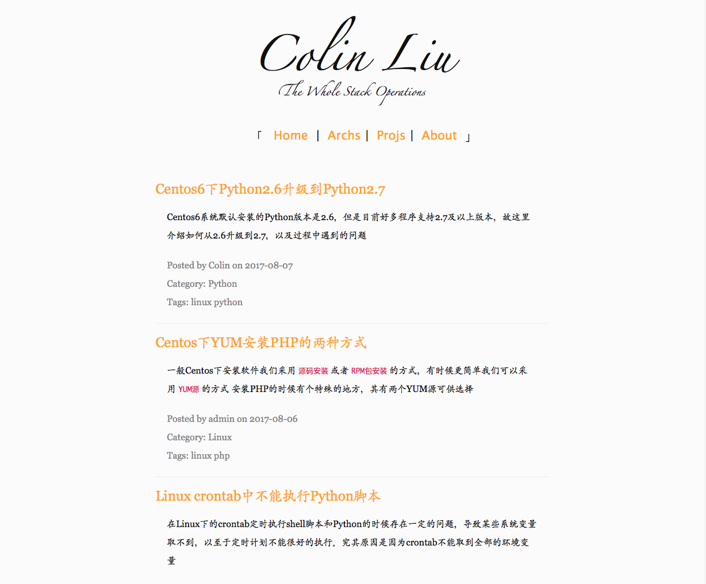
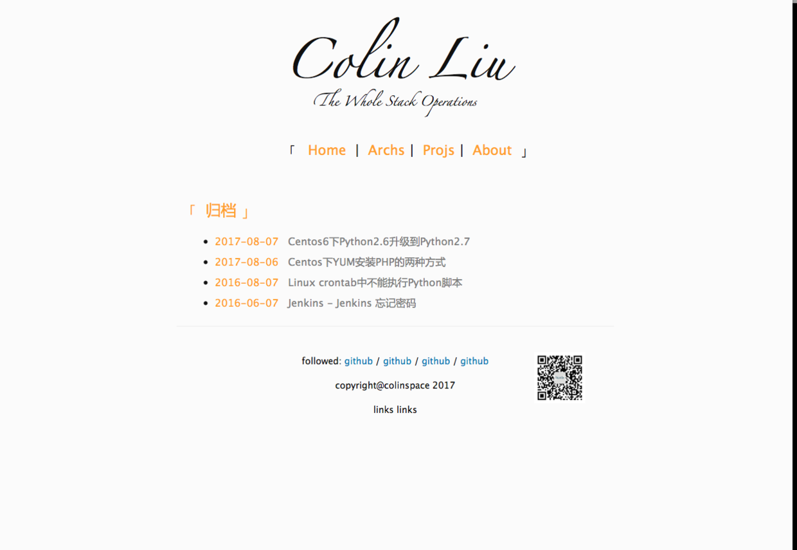

## Abstract

> 作为学习Django实践的项目，这里也用博客项目开始，该项目除了默认按时间排序的归档外
> 添加了按category类别排序和时间排序归档(`/blog/year/2017/`)
> 项目类别和about类别留待开发

---

## 项目环境

+ Python 3.5.3
+ Django 1.11.4
+ Bootstrap 3

## 安装依赖

requirements

```
cffi==1.10.0
Django==1.11.4
houdini.py==0.1.0
misaka==2.1.0
mysqlclient==1.3.10
pycparser==2.18
Pygments==2.2.0
PyMySQL==0.7.11
pytz==2017.2
uWSGI==2.0.15
```

---

## 效果截图





